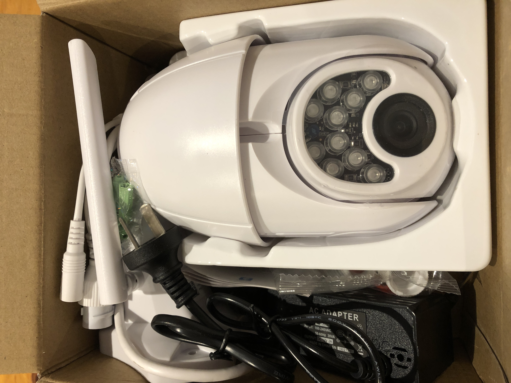
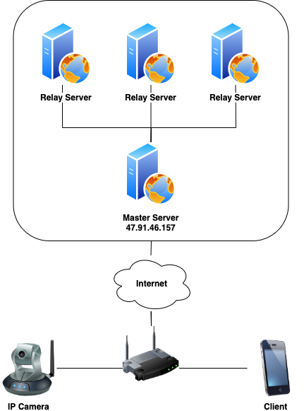
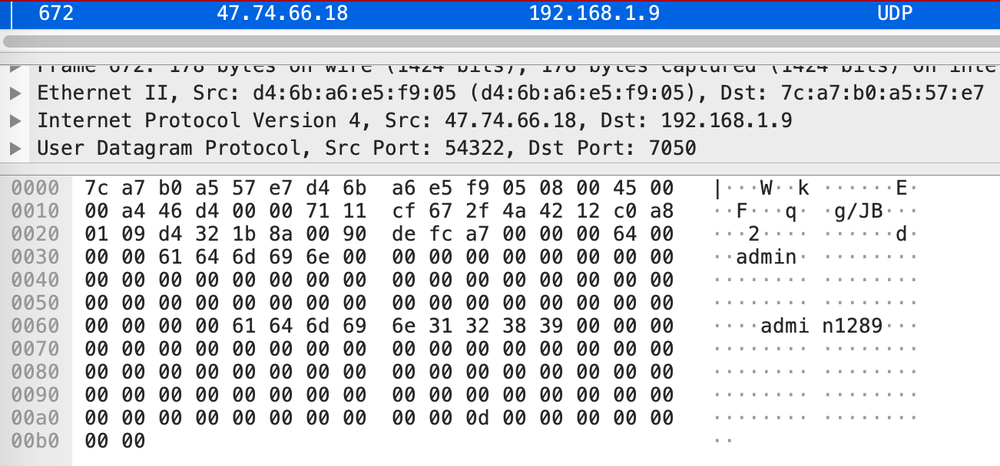
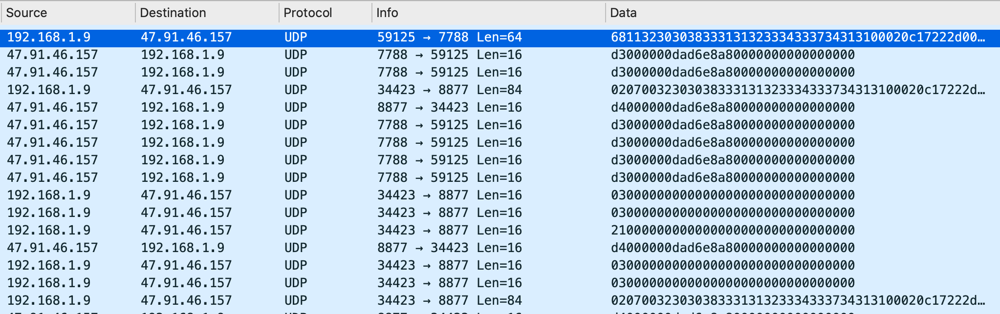
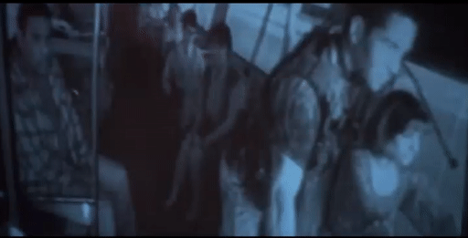
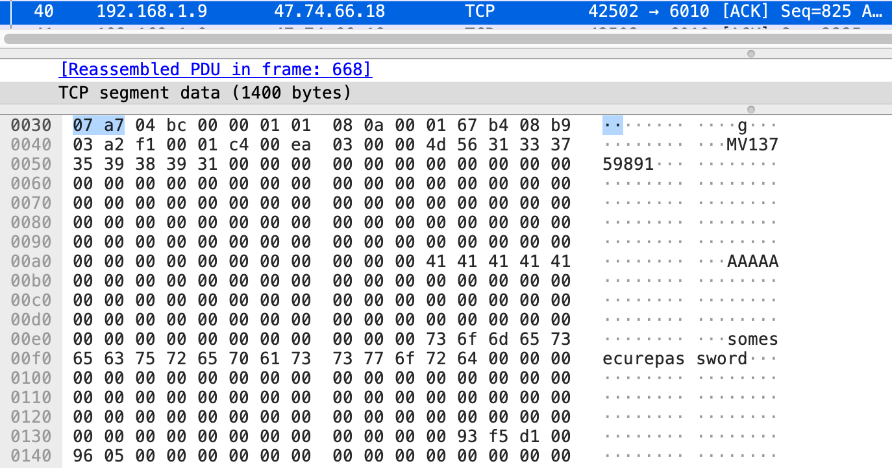

# v380 Pro IP Camera: Security Research

## Background
The v380 Pro is an extremely cheap (~$30 USD) IP camera produced by [Macro-Video technologies](http://www.macro-video.com/en/) that seems to be pretty popular.

*matt: mention that the boundaries between cameras, brands and vendors is often grey, tech is re-used and is from one underlying source, so this applies to other makes of cams*

> Macro-video technologies is a leading CCTV manufacturer in China market, we have been doing CCTV business for more than 8 years

These IP cameras are, like many "Internet of Things" devices, often poorely secured, so I decided to obtain a camera and took a look for myself.

<p align="center">
  
</p>

The camera can be connected to a network using wired Ethernet or via Wi-Fi. It's configured using an [Android](https://play.google.com/store/apps/details?id=com.macrovideo.v380pro&hl=en_AU) or [iOS]() app, or using a thick-client for Windows.

Once configured, the camera can be remotely found and streamed via the phone apps and a cloud-based streaming system (described below). The cameras are identified with a cloud device ID and are secured via a username and password.

*matt: show pic of app camera list and in use*

## Previous Research
As with most research projects, it's worth investigating if any other previous research has been done so as to avoid reinventing the wheel.

I found an article by [Cyberlink Security](https://cyberlinksecurity.ie/vulnerabilities-to-exploit-a-chinese-ip-camera/), where they'd already found a hard-coded key (`macrovideo+*#!^@`) used to encrypt packets containing the device's admin password when being sent from the mobile app to the backend server.

I verified that this hard-coded key is still being used and went over their method for enumerating cloud device ID's, which I [slightly modified](https://github.com/dunderhay/CCTV-v380-pro/blob/master/scripts/discover-cam-online/findcam.py).

This is a good start, but can we go further? I decided to look at the camera side of the system, rather than the client side.


## How the Camera Streams via the Cloud
__*Note:__ A few assumptions had to be made here and the system may not actually work like this. None of this research was done using a cloud account.

Before going into the findings, it helps to understand how the system works. There appears to be three main elements to the system:

- The IP camera itself
- Client application (Android / iOS apps or a Windows native client)
- Backend servers (master and relay servers)

When turned on, the cameras register with the master server with details such as their MAC address and firmware version. Importantly, this also includes the unique cloud device ID. This associates the ID with the source IP, which is communicated with over UDP.

When a client asks the cloud to stream video from the camera, the master server contacts the camera and provides it information of a relay server to connect to. The camera connects to this relay server, which provides the username and password provided by the client app. If the camera accepts the username and password, the video stream is sent to the relay server, which in turn sends it to the client app.

*matt: put arrows showing the username/password and stream going from client <-> master/whatever <-> relay <-> camera in following*

<p align="center">
  
</p>


## Findings

### Capturing Device Credentials
While doing packet analysis, I noticed that the relay server sends the username and password in cleartext to the camera. This was pretty interesting, so I decided to investigate this further.

<p align="center">
  
</p>

My first thought was that it might be possible to pretend to be an arbitrary camera by spoofing its registration under a given cloud camera ID to the backend servers, handle the relaying process, and then receive these password packets.

*matt: put arrows showing divered password packet in following*

<p align="center">
  
</p>

To do this I first looked at the packets sent by the real IP camera as part of registration to the master server. After plugging in the camera and capturing the data with Wireshark, we can see the following packets are sent to the master and relay servers:

*matt: include relay server stuff?*

<p align="center">
  
</p>

The next step was to attempt to emulate this with a Python script. The following [proof-of-concept](https://github.com/dunderhay/CCTV-v380-pro/blob/master/scripts/advertise-camera/poc1_getcreds.py) sends the packets required to register a camera to the master server and handles the connection to the relay servers.

After running, when a user attempts to stream the camera through the cloud, their username and password is captured:

[](https://www.youtube.com/watch?v=DFWzTOUxXx0)

<p align="center">
  <video width="100%" height="100%" controls="true" allowfullscreen="true">
  <source src="" type="video/mp4">
</video>
</p>

We now have the three magic bits of information required to successfully connect to the real camera's stream!

- Camera cloud device ID
- Username
- Password

The underlying issues here are:

1. The relay server sends the username and password in cleartext. *matt: but how else would it do it?*
2. The relay server does not validate that the client is allowed to connect to the camera. *matt: but how can it without asking the camera?*
3. The relay server does not validate the mac address of the camera. *matt: but this isn't really the problem*
*matt: the real problem is that ... need to think about it*

## Injecting Video Footage
My next thought was that, since we can get this far in the "start a video stream" request process, the next step is for the script to tell the relay server that the password is correct. From here, the script can start sending video data through the relay server to the client.

The video feed is sent via TCP directly after the relay server sends the final UDP packet starting with `fe..`, which indicates "start streaming".

<p align="center">
  
</p>

A second [proof-of-concept](https://github.com/dunderhay/CCTV-v380-pro/blob/master/scripts/advertise-camera/poc2_injectVideo.py) was created to inject a video feed after the relay server had authenticated to the camera. The net result is that the user sees faked video rather than their real camera:

*matt: fake the looping better lol*

[](https://www.youtube.com/watch?v=HJZgnQDDzSc)

This immediately reminded me of the 1996 movie "Speed", where the police attempt to trick the bad guy by finding the video feed from the CCTV camera in the bus, looping it and sending it back to him:

<p align="center">
  
  
</p>

This concept has also been used in several heist movies, where the camera is watching some valuable items (a bank vault filled with jewels or something) and the bad guys are able to loop the video footage to appear as normal while they steal said valuable items. A quick demo of a real-world attack is shown below.

[](https://www.youtube.com/watch?v=Ocv1Sp3wJNQ)

But why does this even matter? These cameras are just watching useless things like someone's backyard right?

<p align="center">
  
</p>


### No Authentication Required on LAN
While the cameras require authentication when viewing the video stream remotely (via a relay server), if an attacker has local network access, it's possible to connect to the IP camera via RTSP directly without needing credentials.

To find individual v380 IP cameras on the network, I wrote the following [script](https://github.com/dunderhay/CCTV-v380-pro/blob/master/scripts/discover-cam-on-network/findcam.py) to send out broadcast requests periodically as done by the client and listen for a response from the camera.

[](https://www.youtube.com/watch?v=NiNLFB_tTFg)

Once a camera is found, it's possible to connect directly to the video feed on port 554 using VLC player without providing any credentials:

[](https://www.youtube.com/watch?v=hgbGK8burH8)

The underlying issue here is the lack of authentication required to view video stream of an IP camera device on the LAN.

As per [RFC2326](https://tools.ietf.org/html/rfc2326), RTSP shares the same authentication schemes as HTTP. Any form of authentication is better than none.


### Wi-Fi SSID and Password Sent in Cleartext
During configuration of the device, I noticed that the camera is sending the Wi-Fi SSID (here `AAAAA`) and password (`somesecurepassword`) in cleartext to the relay server.

<p align="center">
  
</p>

This could be an interesting area for additional research.


## An interesting aside 
When first testing my (password-capturing script)[#user-content-capturing-device-credentials], I was super excited to see a username and password roll in within a few seconds. However, after repeating the process, I quickly received a different password, and then another...

```
[+] Valid relay server IP address found: 118.190.204.96:53067
[*] Responding to relay server with device ID: 12345678.
[+] Username: 15214040382
[+] Password: mj13893408103

[+] Valid relay server IP address found: 119.3.37.82:61317
[*] Responding to relay server with device ID: 12345678.
[+] Username: 12345678
[+] Password: a123456

[+] Valid relay server IP address found: 120.78.134.35:50489
[*] Responding to relay server with device ID: 12345678.
[+] Username: ycl
[+] Password: 138830yc

[+] Valid relay server IP address found: 39.108.13.9:65229
[*] Responding to relay server with device ID: 12345678.
[+] Username: admin
[+] Password: okok591939
```

It appears that someone is attempting to brute-force passwords for some of these devices!


## Thoughts
*matt: cheap camera bad
thanks to work for buying camera (yes, do it) and maybe your friend for helping
like subscribe follow*


*matt: tidy up your repos, delete all the 1,2,3,4,5,6.py shit and the bruteforce .txt maybe. make sure all scripts are linked explicitly in the blog post (and again at the bottom here*
