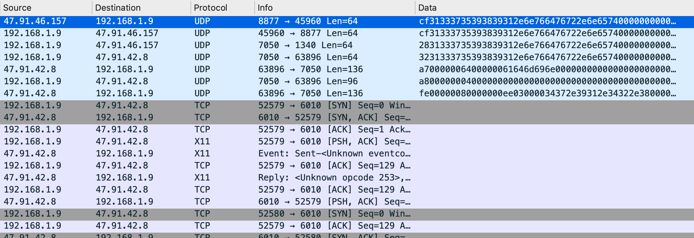

# How to Confuse Your Handler

## Background
The goal of this research was to find security issues that could be easily exploited by an attacker during red team engagements, if the organisation is using the specific v380 CCTV camera. 

<p align="center">
  
</p>

The v380 pro is an extremely cheap (~$50 NZD) IP camera produced by [Macro-Video technologies](http://www.macro-video.com/en/) and seems to be pretty popular. It is sold by several online resellers and providers. 

> Macro-video technologies is a leading CCTV manufacturer in China market, we have been doing CCTV business for more than 8 years,

The camera can be connected to a network in the following ways:

- via Ethernet
- via Wi-Fi

The IP Camera is configured using an [Android](https://play.google.com/store/apps/details?id=com.macrovideo.v380pro&hl=en_AU) or [IOS]() app, or using a thick-client for Windows.

As with most research projects, it is worth investigating if any other previous research has been done as to avoid reinventing the wheel. I found the following article by [Cyberlink Security](https://cyberlinksecurity.ie/vulnerabilities-to-exploit-a-chinese-ip-camera/), where they'd already found a hard-coded key (`macrovideo+*#!^@`) used to encrypt packets containing the device's admin password when being sent from the mobile app to the backend server.

I verified that this hard-coded key is still being used and went over the method for enumerating v380 Camera device ID's, which I [slightly modified](https://github.com/dunderhay/v380-research/blob/master/find_devices/find_online/findcam.py).


## How the Video Streaming Works*
Before going into the findings, it helps to understand how the system works. There appears to be three main elements to the system (that I have named):

- Backend Servers (Master and Relay servers)
- IP Camera
- Client (Android / IOS Apps or a Windows .exe executable)

Despite the camera having RTSP port 554 open... the client apps do not directly receive the video feed from the camera. Instead the video feed is sent to a backend server, which acts as a relay. 

This process can be broken down as shown below:

1. A Client would like to stream video and authenticates to a relay server. The client sends a username and password in an encrypted packet.
2. The relay server that handles the video stream then authenticates to the IP Camera. The relay server sends the username and password to the camera in cleartext.
3. If the username and password is correct, the IP Camera can start sending the video stream to the relay server.
4. The relay server sends the video stream to the client that initiated the connection.

<p align="center">
  
</p>

__*Note:__ A few assumptions had to be made here and the system may not actually work like this. None of the research was done using a cloud account.

---
## Findings:

### Finding #1: Capturing Device Credentials and Injecting Video Footage

While doing packet analysis, I noticed that the backend relay server sends the username and password in cleartext to the camera. This was pretty interesting, so I decided to investigate this further.

<p align="center">
  
</p>

My first thought was to see if it was possible to capture this packet containing the cleartext password in some way. Is it possible to advertise an existing camera device by sending the DeviceID to the backend (master and relay) servers and listen for the response containing the admin credentials?

<p align="center">
  
</p>

To advertise a new device first look at the packets sent by the real IP camera and attempt to emulate this process with our script. After plugging in the camera and capturing the data with wireshark, we can see the following packets are sent to the master server:

<p align="center">
  
</p> 

The following [Proof-of-Concept](https://github.com/dunderhay/v380-research/blob/master/fake_IP_camera/poc_getcreds.py) sends the packets required to advertise a camera device to the master and relay servers. The script handles users attempting to connect to the camera's video stream. When a user requests to view the video stream, it first needs the relay server to authenticate to the camera. The script will respond, and the relay server attempts to authenticate to our fake camera / script (this is the packet response containing the cleartext admin username and password).

<p align="center">
  <video width="100%" height="100%" controls="true" allowfullscreen="true">
  <source src="poc1.mp4" type="video/mp4">
</video>
</p>

We now have the three magic bits of information required to successfully connect to this camera feed:

- DeviceID
- Username
- Password

Each camera advertisement packet does contain the MAC Address for the IP camera; however, this is not validated by the relay server and the password is sent regardless of the MAC address specified.

The underlying issues here are:

1. The relay server sends the username and password in cleartext.
2. The relay server does not validate that the client is allowed to connect to the camera.
3. The relay server does not validate the mac address of the camera.

The next thought was that, since we can get this far in the "start a video stream" request process, the next step is for the camera to tell the relay server that the password is correct. From here, the camera can start sending video data through the relay server to the client. The video feed is sent via TCP directly after the relay server sends the final UDP packet starting with `fe..`, which indicates "start streaming".

<p align="center">
  
</p> 


This immediately reminded me of the 1996 movie "Speed", where the police attempt to trick the bad guy by finding the video feed from the CCTV camera in the bus, looping it and sending back to the camera. 

<p align="center">
  
  
</p>

A second [proof-of-concept](https://github.com/dunderhay/v380-research/blob/master/fake_IP_camera/poc2-replay-video.py) was created to inject a video feed after the relay server had authenticated to the camera.

<p align="center">
  <video width="100%" height="100%" controls="true" allowfullscreen="true">
  <source src="poc2.mp4" type="video/mp4">
</video>
</p>

This concept has been used in several heist movies, where the camera is watching some valuable items (a bank vault filled with jewels or something) and the bad guys are able to loop the video footage to appear as normal while they steal said valuable items. A quick demo of a real-world attack is shown below.

<p align="center">
  <video width="100%" height="100%" controls="true" allowfullscreen="true">
  <source src="apple-crimes.mp4" type="video/mp4">
</video>
</p>

But why does this even matter? These cameras are just watching useless things like someone's backyard right?

<p align="center">
  
</p>

---
### Finding #2: No Authentication Required on LAN

While the cameras require authentication when viewing the video stream remotely (via a relay server), if an attacker has local network access, it is possible to connect to the IP camera via RTSP directly without needing credentials.


To find individual v380 IP cameras on the network, I wrote the following [script](https://github.com/dunderhay/v380-research/blob/master/find_devices/find_local/findcam.py) to send out broadcast requests periodically as done by the client and listen for a response from the camera.

<p align="center">
  <video width="100%" height="100%" controls="true" allowfullscreen="true">
  <source src="find-camera-lan.mp4" type="video/mp4">
</video>
</p>

Once a camera is found, it is possible to connect directly to the video feed on port 554 using VLC player without providing any credentials:


<p align="center">
  <video width="100%" height="100%" controls="true" allowfullscreen="true">
  <source src="rtsp-without-password.mp4" type="video/mp4">
</video>
</p>

The underlying issues here is the lack of authentication required to view video stream of an IP camera device on the LAN.

As per [RFC2326](https://tools.ietf.org/html/rfc2326), RTSP shares the same authentication schemes as HTTP. Any form of authentication is better than none.

---
### Finding #3: Wi-Fi SSID and Password Sent in Cleartext

During configuration of the device, I noticed that the CCTV Camera is sending the Wi-Fi SSID (`AAAAA`) and password (`somesecurepassword`) in cleartext to the relay server. 

<p align="center">
  
</p>

This could be an interesting area for additional research. 

---
### Not really a finding... 

When first testing my password capturing admin credentials script, I was super excited to see a username and password roll in within a few seconds. However, after repeating the process, I received a different password, and then another... It appears that someone is attempting to brute-force passwords for some of these devices.

```
[+] Valid relay server IP address found: 118.190.204.96:53067
[*] Responding to relay server with device ID: 12345678.
[+] Username: 15214040382
[+] Password: mj13893408103

[+] Valid relay server IP address found: 119.3.37.82:61317
[*] Responding to relay server with device ID: 12345678.
[+] Username: 12345678
[+] Password: a123456

[+] Valid relay server IP address found: 120.78.134.35:50489
[*] Responding to relay server with device ID: 12345678.
[+] Username: ycl
[+] Password: 138830yc

[+] Valid relay server IP address found: 39.108.13.9:65229
[*] Responding to relay server with device ID: 12345678.
[+] Username: admin
[+] Password: okok591939
```


